# 🗑 IoT Smart Waste Management & Predictive Bin Monitoring System

An intelligent IoT-based Smart Waste Management System designed to monitor waste bins in real time, analyze waste accumulation trends, predict overflow events, and assist collection planning using data-driven insights.

This project combines MQTT communication, HiveMQ Cloud, Node-RED dashboards, Python analytics, SQLite storage, and Streamlit visualization to create a complete smart waste monitoring ecosystem.

---

## 🚀 Project Overview

Traditional waste collection systems often rely on fixed schedules, resulting in overflowing bins, inefficient collection routes, and unnecessary operational costs.

This system addresses these challenges by:

* Monitoring bin fill levels in real time
* Tracking environmental conditions
* Detecting waste accumulation trends
* Predicting potential overflow events
* Prioritizing collection operations
* Providing actionable operational insights

---

## 🚀 Live Demo

Experience the Smart Waste Management Dashboard in action:

### 🌐 Streamlit Dashboard

**Live Application:**
https://iot-smart-waste-management-bin-level-detection-system-vurzutjs.streamlit.app/

### 📊 Features Available in Demo

* Real-Time Waste Bin Monitoring
* Operational Intelligence Dashboard
* Fill Level Trend Analysis
* Priority Collection Queue
* Overflow Risk Assessment
* Smart Route Recommendation
* Time-To-Full Prediction
* Executive Summary Generation

> The dashboard automatically analyzes incoming waste data and provides actionable insights for efficient waste collection planning.

---

## ✨ Key Features

### 📡 Real-Time Monitoring

* Fill Percentage Tracking
* Temperature Monitoring
* Humidity Monitoring
* Gas Level Detection
* Bin Status Classification

### ☁ Cloud Connectivity

* MQTT Communication
* HiveMQ Cloud Integration
* Real-Time Data Streaming

### 📊 Interactive Dashboards

* Node-RED Dashboard
* Streamlit Analytics Dashboard
* Operational Briefing Panel
* Waste Trend Visualization

### 🤖 Predictive Analytics

* Time-To-Full Prediction
* Overflow Forecasting
* Risk Assessment
* Collection Priority Recommendations

### 🗄 Data Management

* SQLite Database Storage
* Historical Data Logging
* CSV Data Export
* Daily & Weekly Reports

---

## 🏗 System Architecture

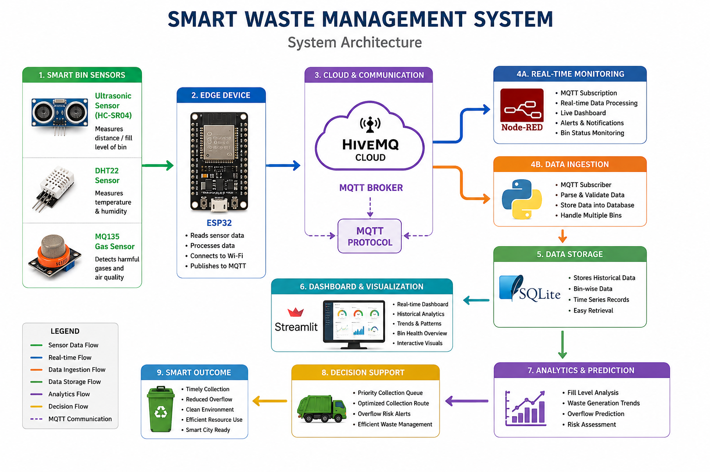

### Data Flow

Sensors / Simulation
↓
ESP32
↓
MQTT Protocol
↓
HiveMQ Cloud
↓
Node-RED Dashboard
↓
Python Subscriber
↓
SQLite Database
↓
Streamlit Dashboard
↓
Analytics & Prediction Engine

---

## 📂 Project Structure

```text
IoT-Smart-Waste-Management-Predictive-Bin-Monitoring-System
│
├── arduino_code/
├── circuit_diagram/
├── data/
├── database/
├── docs/
├── images/
├── node_red/
├── outputs/
├── python_simulation/
├── reports/
├── streamlit_dashboard/
│
├── README.md
├── LICENSE
├── requirements.txt
└── .gitignore
```

---

## 🛠 Technologies Used

### Hardware

* ESP32
* HC-SR04 Ultrasonic Sensor
* DHT22 Sensor
* MQ135 Gas Sensor

### Software

* Python
* Streamlit
* SQLite
* MQTT
* HiveMQ Cloud
* Node-RED
* Pandas
* Plotly

---

## 📊 Dashboard Screenshots

### Smart Waste Management Dashboard
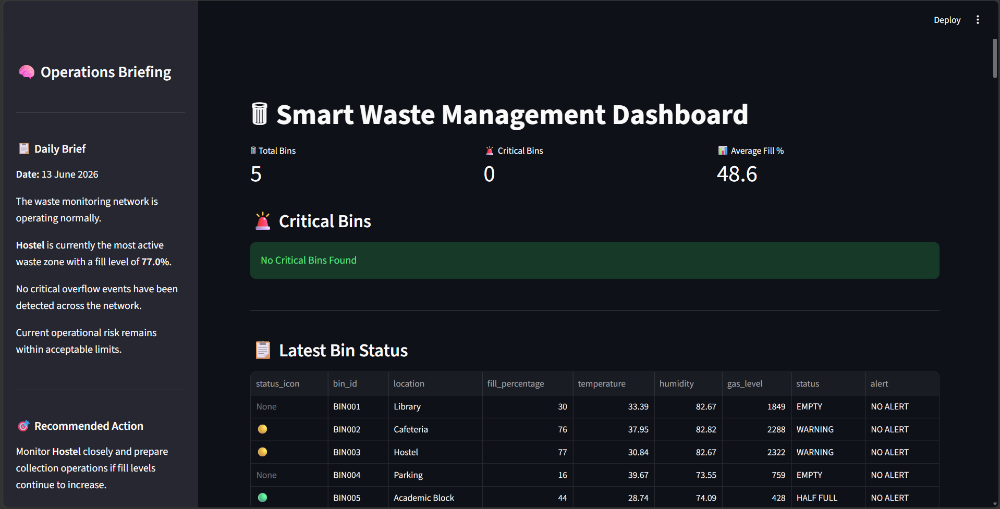

### Operations Briefing
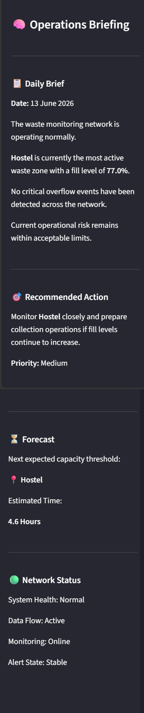

### Latest Bin Status
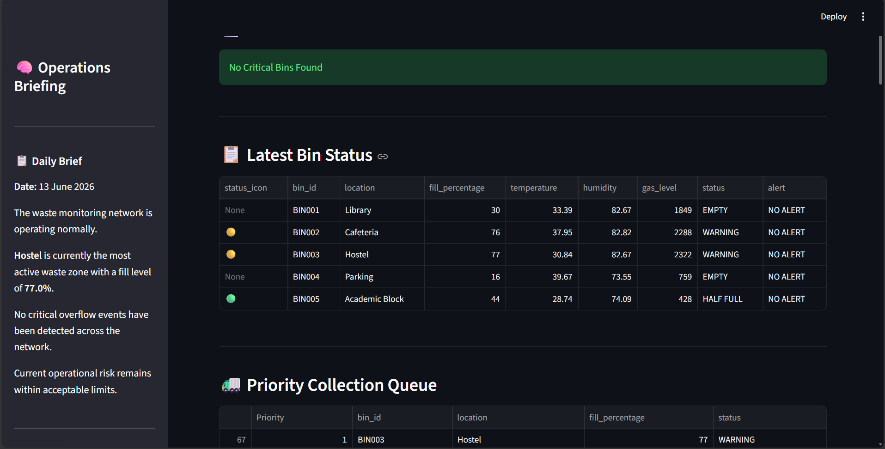

### Waste Fill Trends
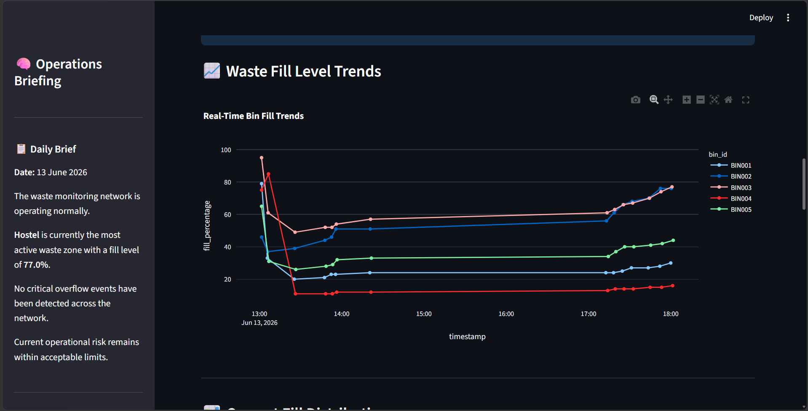

### Priority Collection Queue
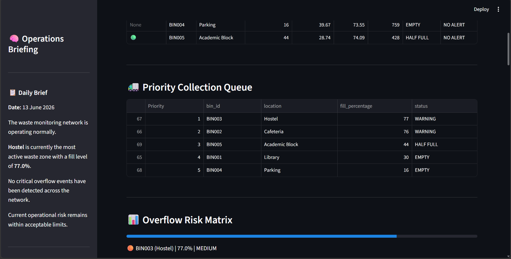

### Overflow Risk Matrix
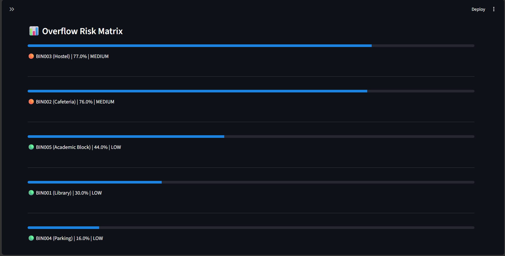

### Smart Route Recommendation
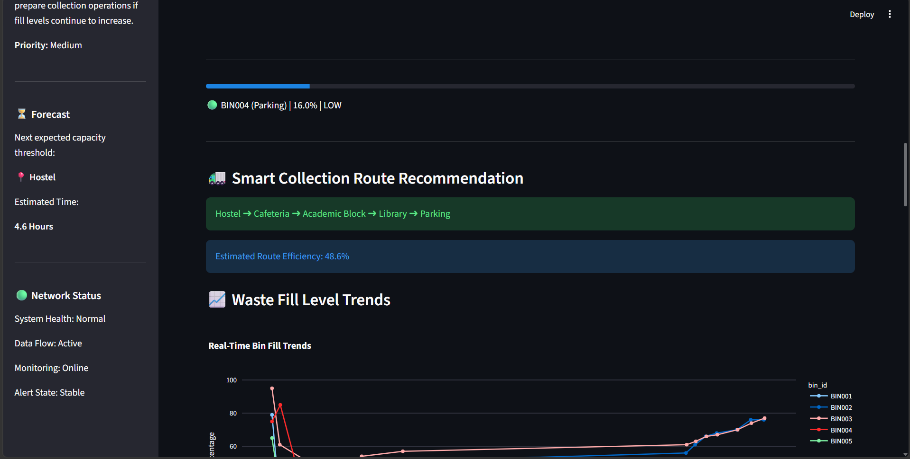

### Time To Full Prediction
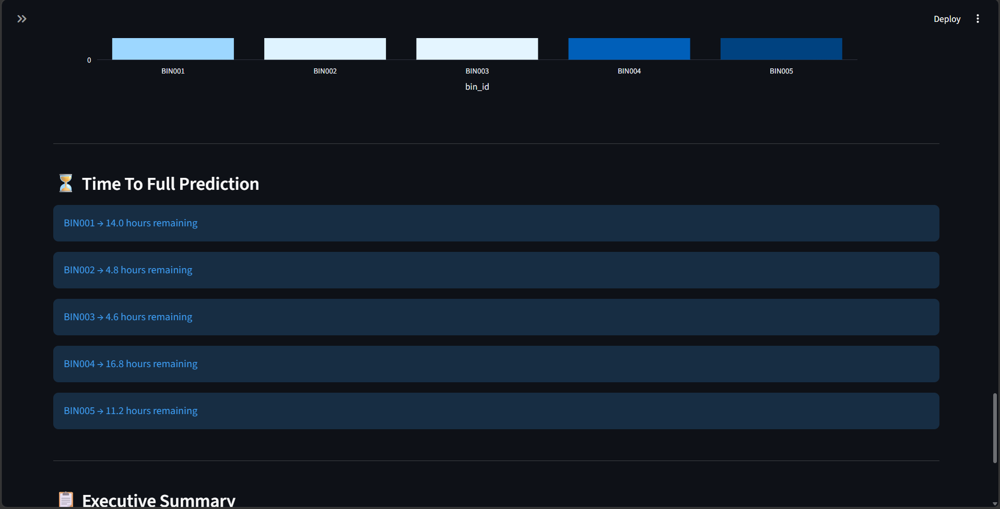

### Node-RED Dashboard
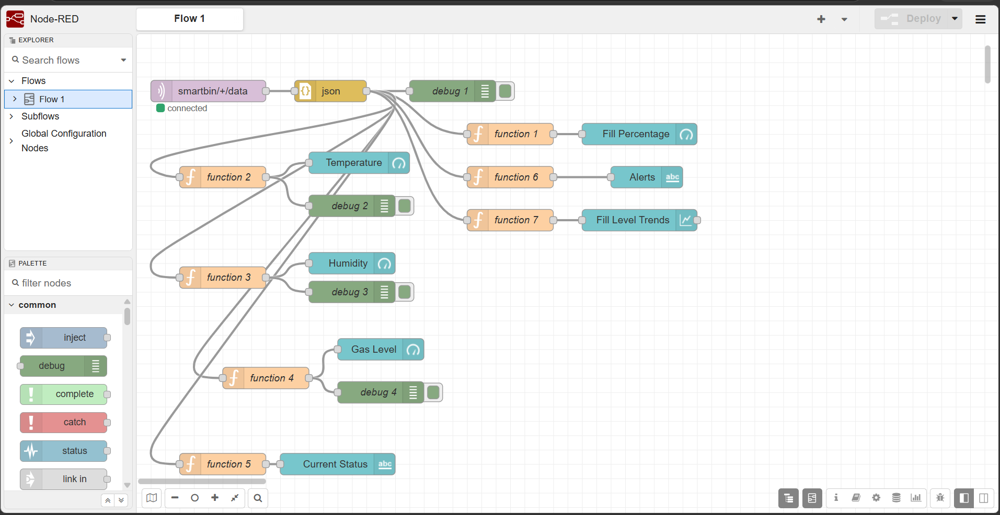

### Workflow
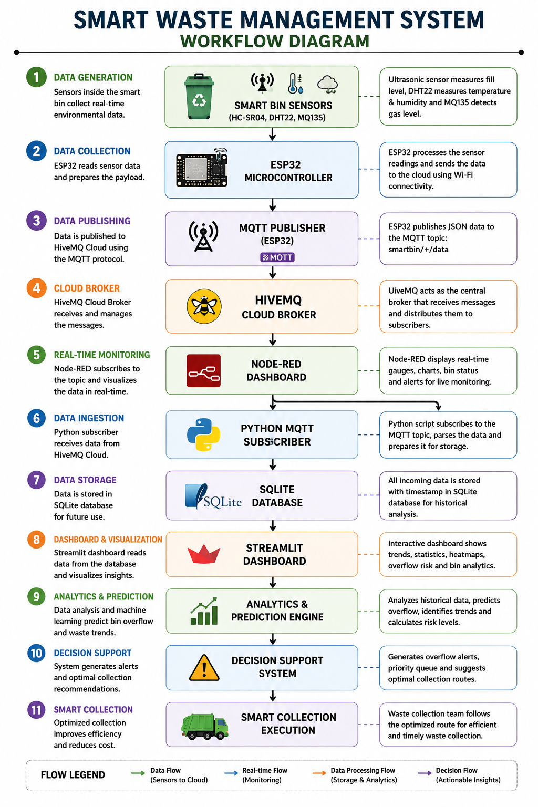

---

## 📈 Analytics Modules

### Waste Fill Trend Analysis

Tracks waste accumulation patterns across multiple bins.

### Overflow Risk Assessment

Identifies bins approaching critical capacity levels.

### Smart Collection Recommendation

Prioritizes waste collection based on current conditions.

### Time-To-Full Prediction

Estimates the remaining time before a bin reaches maximum capacity.

### Executive Summary Generation

Provides operational insights for decision-makers.

---

## 📑 Reports

Generated Reports:

* Daily Summary Report
* Weekly Summary Report
* Predictive Overflow Report
* Waste Trend Analysis

Stored in:

```text
reports/
```

---

## 🧪 Simulation Environment

The project includes a complete Python-based simulation environment for generating realistic sensor data.

Features:

* Multi-bin Simulation
* Dynamic Fill Levels
* Temperature Variations
* Humidity Variations
* Gas Concentration Simulation
* MQTT Publishing

Location:

```text
python_simulation/
```

---

## 📦 Installation

### Clone Repository

```bash
git clone https://github.com/VaishnavaDevi-R/IoT-Smart-Waste-Management-Bin-Level-Detection-System.git
```

### Navigate to Project

```bash
cd IoT-Smart-Waste-Management-Predictive-Bin-Monitoring-System
```

### Create Virtual Environment

```bash
python -m venv venv
```

### Activate Environment

```bash
venv\Scripts\activate
```

### Install Dependencies

```bash
pip install -r requirements.txt
```

---

## ▶ Running the Project

### Start Data Simulation

```bash
python python_simulation/simulate_bins.py
```

### Start MQTT Subscriber

```bash
python python_simulation/mqtt_publisher.py
```

### Launch Streamlit Dashboard

```bash
streamlit run streamlit_dashboard/app.py
```

### Open Node-RED

```bash
node-red
```

Visit:

```text
http://localhost:1880/ui
```

---

## 🎯 Future Enhancements

* Machine Learning-Based Forecasting
* Route Optimization Algorithms
* SMS / Email Alerts
* Mobile Application
* GIS-Based Bin Mapping
* Computer Vision Waste Detection

---

## 👩‍💻 Author

**Vaishnava Devi**


---

## 📄 License

This project is licensed under the MIT License.
